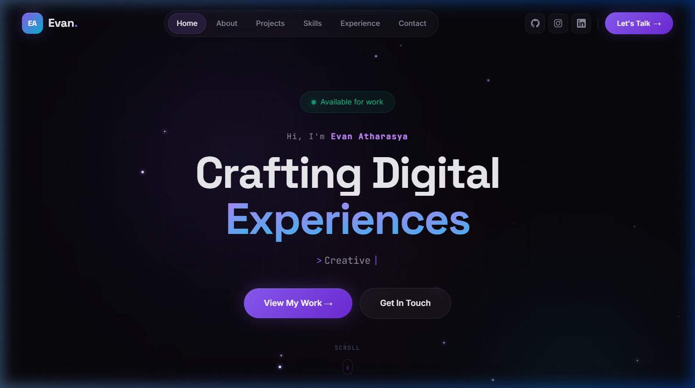

<div align="center">

# ✨ Evan Atharasya — Portfolio

### *Crafting Digital Experiences*

[](https://evanatharasya.vercel.app)
[](https://github.com/ESTAS-crypto)
[](https://instagram.com/evanatharasya.x)
[](https://www.linkedin.com/in/evan-atharasya-64b1621b7/)

<br/>



<br/>

*A modern, interactive developer portfolio built with React & Framer Motion.*
*Featuring glassmorphism design, smooth animations, and real-time GitHub integration.*

</div>

---

## 🚀 Features

| Feature | Description |
|:---:|---|
| 🎨 | **Glassmorphism UI** — Premium dark theme with glass-effect cards, gradient accents, and noise overlay |
| ✨ | **Micro-animations** — Smooth scroll reveals, magnetic buttons, typing effects, and floating orbs powered by Framer Motion |
| 📱 | **Fully Responsive** — Optimized for desktop, tablet, and mobile with adaptive bottom navigation bar |
| 🔗 | **Live GitHub Integration** — Projects fetched from GitHub API with smart caching (30-min TTL) to avoid rate limiting |
| 🌐 | **Social Links** — Direct links to GitHub, Instagram, and LinkedIn with proper SVG brand icons |
| ⚡ | **Performance** — Intersection Observer-based lazy animations, no unnecessary re-renders |
| 🛡️ | **Error Resilience** — Graceful fallback UI when GitHub API is rate-limited, with retry functionality |
| 🧩 | **Modular Architecture** — Centralized constants, shared hooks, and reusable icon components |

---

## 🖼️ Sections

<div align="center">

| | Section | Description |
|:---:|:---|:---|
| 🏠 | **Hero** | Animated intro with typing effect & floating orbs |
| 👤 | **About** | Bio, skill bars & GitHub stats in a bento grid |
| 💼 | **Projects** | Live repo cards fetched from GitHub API |
| ⚡ | **Skills** | Infinite-scroll tech stack marquee |
| 📋 | **Experience** | Interactive expandable timeline |
| ✉️ | **Contact** | Message form & social media cards |

</div>

---

## 🛠️ Tech Stack

<div align="center">


</div>

---

## 📁 Project Structure

```
src/
├── constants.js          # 📋 All data constants (edit here → updates everywhere)
├── hooks/
│   ├── useIsMobile.js    # 📱 Responsive breakpoint hook
│   └── useGitHub.js      # 🔗 Cached GitHub API utility
├── components/
│   ├── Icons.jsx         # 🎨 Shared SVG icon components
│   ├── Navbar.jsx        # 🧭 Desktop nav + mobile bottom bar
│   ├── Hero.jsx          # 🏠 Landing section with parallax
│   ├── About.jsx         # 👤 Bio + skills bento grid
│   ├── Projects.jsx      # 💼 GitHub repos with cards
│   ├── Skills.jsx        # ⚡ Infinite marquee tech stack
│   ├── Experience.jsx    # 📋 Interactive timeline
│   ├── Contact.jsx       # ✉️ Form + social cards
│   ├── Footer.jsx        # 📄 Footer with gradient
│   └── CustomCursor.jsx  # 🖱️ Custom cursor (desktop only)
├── index.css             # 🎨 Global styles + responsive queries
├── App.jsx               # 📦 Root component
└── main.jsx              # 🚀 Entry point
```

---

## ⚡ Quick Start

```bash
# Clone the repository
git clone https://github.com/ESTAS-crypto/portofolio.git

# Navigate to the project
cd portofolio

# Install dependencies
npm install

# Start development server
npm run dev
```

Open [http://localhost:5173](http://localhost:5173) in your browser.

---

## 🔧 Configuration

All personal data is centralized in **`src/constants.js`**:

```javascript
// Change your social links
export const SOCIAL_LINKS = [
  { name: 'GitHub',    url: 'https://github.com/ESTAS-crypto', ... },
  { name: 'Instagram', url: 'https://instagram.com/evanatharasya.x', ... },
  { name: 'LinkedIn',  url: 'https://linkedin.com/in/...', ... },
];

// Change your skills, experience, tech stack, etc.
export const SKILLS = [ ... ];
export const EXPERIENCES = [ ... ];
export const TECH_STACK = [ ... ];
```

| Want to change... | Edit in `constants.js` |
|---|---|
| Social media links | `SOCIAL_LINKS` |
| GitHub username | `GITHUB_USERNAME` |
| Name & tagline | `PROFILE` |
| Skills & levels | `SKILLS` |
| Tech stack marquee | `TECH_STACK` |
| Experience timeline | `EXPERIENCES` |
| Nav items | `NAV_ITEMS` |

---

## 📦 Build for Production

```bash
npm run build
```

Output will be in the `dist/` folder, ready for deployment on Vercel, Netlify, or any static hosting.

---

## 🎨 Design Philosophy

- **Dark-first** — Deep navy/black background with vibrant purple accents
- **Glassmorphism** — Frosted glass cards with subtle borders and blur effects
- **Motion-driven** — Every interaction has purpose; nothing is static
- **Mobile-native** — Touch-optimized bottom nav, larger tap targets, reduced animations on mobile
- **Data-driven** — Projects pull from GitHub API, stats update automatically

---

<div align="center">

### Made with 💜 by Evan Atharasya

*If you like this portfolio, consider giving it a ⭐!*

</div>
